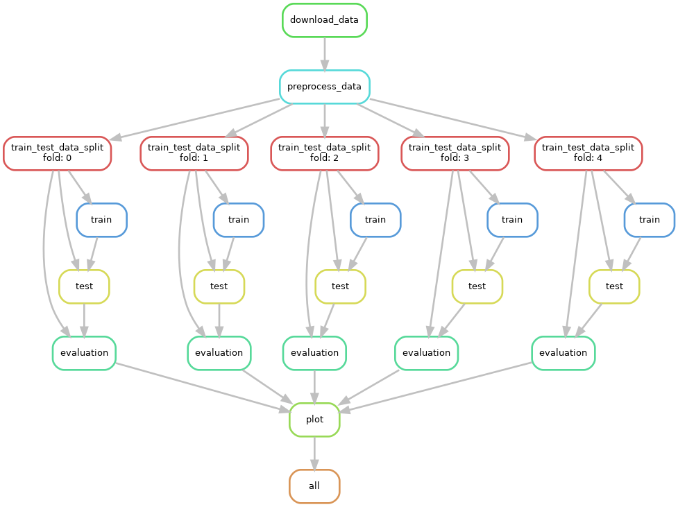

# Reproducibility

In this module, we will learn how to use Snakemake for reproducible research.

# Task

Implement the workflow described below:
1. **Data Download**: Downloads the Titanic dataset from a URL to a raw data directory.
2. **Data Preprocessing**: Imputes missing values and encodes categorical variables, saving the processed data in a directory.
3. **Train-Test Split**: Splits the data into K folds for cross-validation, storing train and test datasets per fold.
4. **Model Training**: Trains Logistic Regression, Random Forest, SVC, and KNeighborsClassifier models per fold, saving them in a directory.
5. **Model Testing**: Uses models to predict on test datasets, saving predictions.
6. **Evaluation**: Computes AUC ROC scores for model performance, saving results.
7. **Plotting**: Generates and saves a plot comparing AUC ROC scores across models and folds.


# Tips for Snakemake

Snakemake is a powerful tool for creating reproducible and scalable data analyses. Workflows are defined in a `Snakefile` which specifies a series of rules. Each rule defines how to create a set of output files from a set of input files.

### Basic Usage

To simply check what Snakemake would do without actually executing the workflow, you can use the `-n` or `--dry-run` option along with the `-p` option to print the shell commands that would be executed:
```bash
snakemake -np
```

To visualize the workflow as a computation graph, Snakemake provides a convenient way to generate a Directed Acyclic Graph (DAG) of the tasks. This can be particularly useful for understanding the dependencies between tasks and for debugging purposes. To create a plot of the computation graph, you can use the following command:

```bash
snakemake --dag all | dot -Tpng > dag.png
```
which will generate a figure like




To run the workflow, run
```bash
snakemake --cores 1 all
```
This means that snakemake will execute the rule `all` by using one CPU core. You can specify the rule to another rule, and use more CPUs if available.

# Git FAQ

1. `No Module <...> found` when running a script although the notebooks and interactive mode work.

All modules are installed in the virtual environment. To see where you are, run the following on the terminal:
```bash
which python
```
if your path does not contain `venv`, it's likely that you are outside of the environment. Then, run on the terminal:
```bash
source /home/vscode/venv/bin/activate
```

2. I would like to test the code in the terminal. How do I do that?

You can run the test on your codespace by running the following on the project root:
```bash
python -m unittest test/test.py
```

3. The instructor made a correction. How can I reflect the changes in my code?

```bash
git fetch upstream
git checkout main
git merge upstream/main
```

4. When merging the changes, my code conflicts with the changes from the instructor. How can I resolve the conflicts?


To resolve conflicts using the command line options `--theirs` and `--ours` with `git checkout`, follow these steps:

- To keep the changes from the current branch (the one you are merging into), use:
  ```bash
  git checkout --ours
  ```
- To keep the changes from the branch you are merging from, use:
  ```bash
  git checkout --theirs
  ```
After resolving the conflicts, don't forget to add the files to staging (`git add .`), and then commit the changes to complete the merge process.


## Git Cheat Sheet

Here's a quick reference to some common Git commands you might find useful:

## Basic Git Commands

- **`git status`**: Check the status of changes as untracked, modified, or staged.

- **`git add <file>`**: Add a file or changes to the staging area for Git. Replace `<file>` with the name of the file you want to add.

- **`git commit -m "message"`**: Commit your changes to the local repository with a commit message. Replace `"message"` with your commit message.

- **`git push`**: Push your commits from your local repository to the remote repository.

## Branching and Merging

- **`git checkout <branch>`**: Switch to another branch in your repository. Replace `<branch>` with the name of the branch you want to switch to.

- **`git merge <branch>`**: Merge changes from another branch into the current branch. Replace `<branch>` with the name of the branch you want to merge from.

- **`git branch`**: List, create, or delete branches. Without additional arguments, it lists existing branches. Use `-d <branch>` to delete a branch, and `<branch>` to create a new branch.

## Remote Repository Operations

- **`git fetch`**: Fetch changes from the remote repository to your local repository but does not merge them.

- **`git pull`**: Fetch from and integrate with another repository or a local branch. This command is used to update your local repository to match the remote repository.

- **`git clone <repository>`**: Clone a repository into a new directory. Replace `<repository>` with the URL of the repository you want to clone.

## File Operations

- **`git rm <file>`**: Remove a file from your working directory and stage the deletion. Replace `<file>` with the name of the file you want to remove.

## History and Difference Checking

- **`git log`**: Show the commit logs.

- **`git log --oneline`**: Show the commit history in a concise format. This is useful for getting a quick overview of the commit history.

- **`git diff`**: Show changes between commits, commit and working tree, etc. Use `git diff --staged` to see changes staged for the next commit.

## Advanced Operations

- **`git reset`**: Reset current HEAD to the specified state. Use `--hard` to discard all changes in your working directory and index, `--soft` to keep your working directory but reset the index.

- **`git revert <commit>`**: Create a new commit that undoes all of the changes made in `<commit>`, then apply it to the current branch.

- **`git stash`**: Stash the changes in a dirty working directory away. Use `git stash apply` to bring back the stashed changes.

- **`git tag <tagname>`**: Create, list, delete or verify a tag object signed with GPG. Replace `<tagname>` with the desired tag for your commit.

Remember to replace placeholders (like `<repository>`, `<branch>`, or `<commit>`) with actual repository URLs, branch names, or commit hashes as needed for your specific commands.


Remember to replace placeholders (like `<file>` or `<branch>`) with actual file names or branch names as needed for your specific commands.


